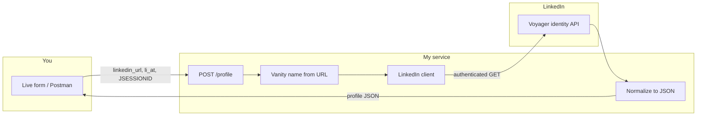
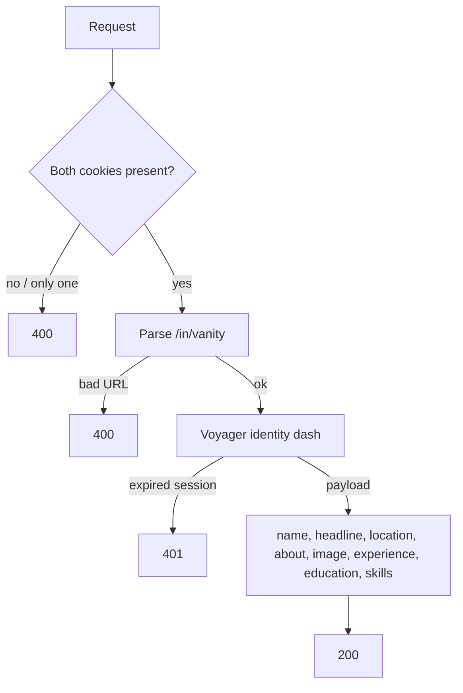

# LinkedIn Profile Parser

I built this as a FastAPI service: you send a LinkedIn profile URL plus your own browser session cookies, and I return that profile as JSON.

**Try it here:** [https://linkedin-parser-s5wh.onrender.com](https://linkedin-parser-s5wh.onrender.com)

Swagger: [https://linkedin-parser-s5wh.onrender.com/docs](https://linkedin-parser-s5wh.onrender.com/docs)

The form on the live site is the main way to test. Paste `li_at` and `JSESSIONID` from your Chrome session (same login, copied at the same time), plus a profile URL like `https://www.linkedin.com/in/username/`. I do not store the cookies. If LinkedIn returns 401, the session expired — copy both cookies again from Chrome.

How I pull them from Chrome: DevTools → Application → Cookies → `https://www.linkedin.com` → copy **Value** for `li_at` and `JSESSIONID`.

## How it works





| File | What I use it for |
| --- | --- |
| `app/static` | The form on the live site |
| `app/main.py` | Routes |
| `app/urls.py` | Vanity name from `linkedin_url` |
| `app/linkedin/client.py` | Calls LinkedIn with your session |
| `app/linkedin/voyager.py` | Maps the payload to `Profile` |
| `app/models.py` | Request / response schema |

## API

`GET /health` → `{ "status": "ok" }`

`POST /profile`

```json
{
  "linkedin_url": "https://www.linkedin.com/in/username/",
  "li_at": "<cookie value>",
  "jsessionid": "<cookie value>"
}
```

```json
{
  "profile": {
    "name": "",
    "headline": "",
    "location": "",
    "about": "",
    "image_url": "",
    "experience": [],
    "education": [],
    "skills": [],
    "certifications": [],
    "languages": []
  }
}
```

Empty fields mean LinkedIn did not send that section for that profile.

| HTTP | Meaning |
| --- | --- |
| 400 | Bad profile URL, or only one of the two cookies |
| 401 | Session expired or the two cookies are not from the same login |
| 422 | Body is not valid JSON / URL |
| 502 | LinkedIn failed on the upstream call |
