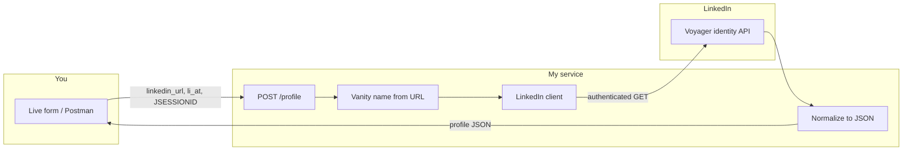
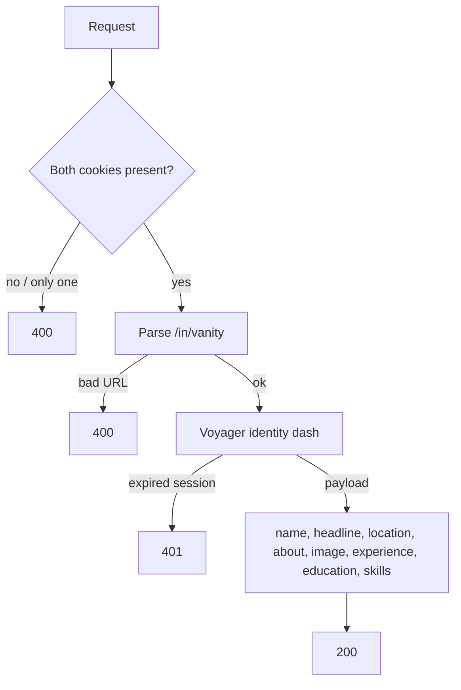
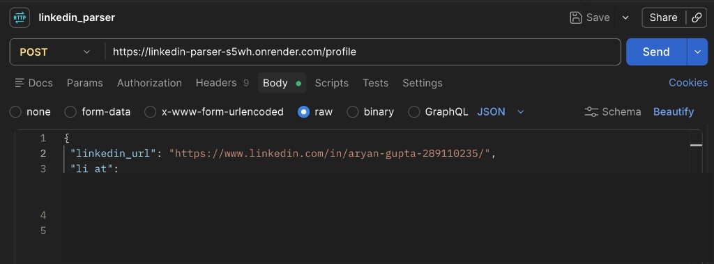
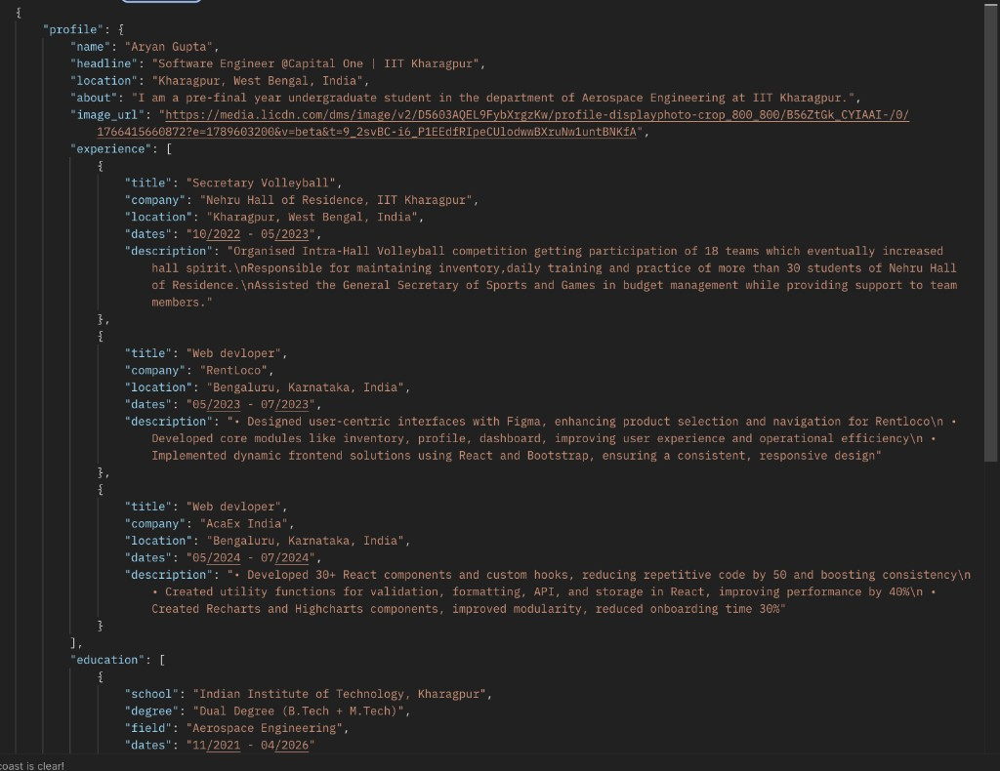

# LinkedIn Profile Parser

I built this as a FastAPI service: you send a LinkedIn profile URL plus your own browser session cookies, and I return that profile as JSON.

**Try it here:** [https://linkedin-parser-s5wh.onrender.com](https://linkedin-parser-s5wh.onrender.com)

Swagger: [https://linkedin-parser-s5wh.onrender.com/docs](https://linkedin-parser-s5wh.onrender.com/docs)

The form on the live site is the main way to test. Paste `li_at` and `JSESSIONID` from your Chrome session (same login, copied at the same time), plus a profile URL like `https://www.linkedin.com/in/username/`. I do not store the cookies. If LinkedIn returns 401, the session expired — copy both cookies again from Chrome.

How I pull them from Chrome: DevTools → Application → Cookies → `https://www.linkedin.com` → copy **Value** for `li_at` and `JSESSIONID`.

## Approach

LinkedIn has no public API I can use here to fetch an arbitrary `/in/...` profile. I replay **your** already-logged-in Chrome session: you send `li_at` + `JSESSIONID` with the URL; I attach those cookies, derive CSRF from `JSESSIONID`, and call Voyager identity dash (`/voyager/api/identity/dash/profiles`). I map that payload into my own JSON schema (`app/models.py`) instead of returning LinkedIn’s raw response.

If identity dash comes back thin, I try Voyager GraphQL, then the flagship SDUI component call as a last resort. I do not scrape `/in/...` HTML (LinkedIn answers that with 999). I do not log in for you, solve CAPTCHA, or store cookies.

## How it works





| File | What I use it for |
| --- | --- |
| `app/static` | The form on the live site |
| `app/main.py` | Routes |
| `app/urls.py` | Vanity name from `linkedin_url` |
| `app/linkedin/client.py` | Calls LinkedIn with your session |
| `app/linkedin/voyager.py` | Maps the payload to `Profile` |
| `app/models.py` | Request / response schema |

## API

`GET /health` → `{ "status": "ok" }`

`POST /profile`



```json
{
  "linkedin_url": "https://www.linkedin.com/in/username/",
  "li_at": "<cookie value>",
  "jsessionid": "<cookie value>"
}
```



```json
{
  "profile": {
    "name": "",
    "headline": "",
    "location": "",
    "about": "",
    "image_url": "",
    "experience": [],
    "education": [],
    "skills": [],
    "certifications": [],
    "languages": []
  }
}
```

Empty fields mean LinkedIn did not send that section for that profile.

| HTTP | Meaning |
| --- | --- |
| 400 | Bad profile URL, or only one of the two cookies |
| 401 | Session expired or the two cookies are not from the same login |
| 422 | Body is not valid JSON / URL |
| 502 | LinkedIn failed on the upstream call |

## Run it on your machine

Clone the repo, install, start the server:

```bash
git clone https://github.com/Blackstocks/linkedin_parser.git
cd linkedin_parser
python3 -m venv .venv
source .venv/bin/activate
pip install -e .
uvicorn app.main:app --host 127.0.0.1 --port 8000
```

On Windows, after creating the venv, run `.venv\Scripts\activate` instead of `source .venv/bin/activate`.

Open [http://127.0.0.1:8000](http://127.0.0.1:8000). Same as the live site: paste your `li_at` and `JSESSIONID` from Chrome (Application → Cookies → `https://www.linkedin.com`), plus a profile URL. Swagger is at [http://127.0.0.1:8000/docs](http://127.0.0.1:8000/docs).

Cookies in the form are enough. `.env` is optional — copy `.env.example` to `.env` only if you want a fallback when the form fields are empty.

## Known limitations

- Cookies die. LinkedIn rotates `li_at` / `JSESSIONID`. A 401 means copy both again from the **same** Chrome session. Mixing cookies from two browsers or two times will fail.
- First lookup can work and the next one 401. That is LinkedIn invalidating the session, not the form “losing” the values.
- Only public-style `/in/{vanity}/` URLs. Company pages, search URLs, and Sales Navigator links return 400.
- A 200 can still have empty `about`, `experience`, `skills`, `certifications`, or `languages`. I only fill what Voyager sent for that profile.
- Certifications and languages are often empty even when the profile page shows them; those blocks frequently live outside the identity-dash payload I use.
- LinkedIn can 429 / 502 if you hammer Send. I do not retry in a loop.
- This is not official LinkedIn OAuth. If they change Voyager decorations or start challenging the session, lookups break until the client is updated.
- Cold start: the live Render URL can take a few seconds on the first hit after idle.
